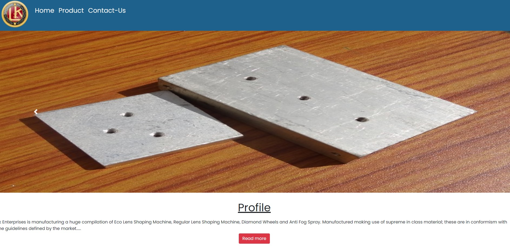
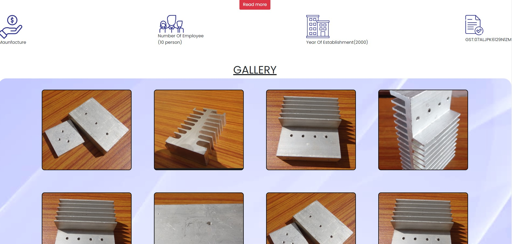
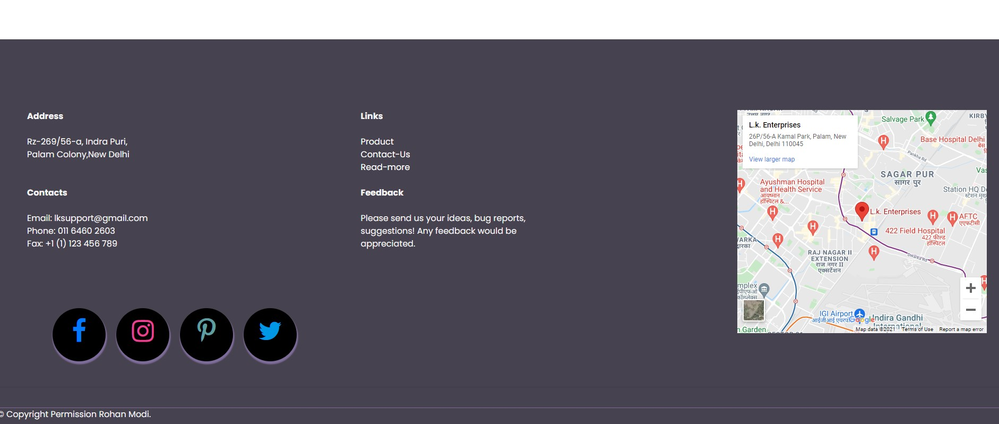
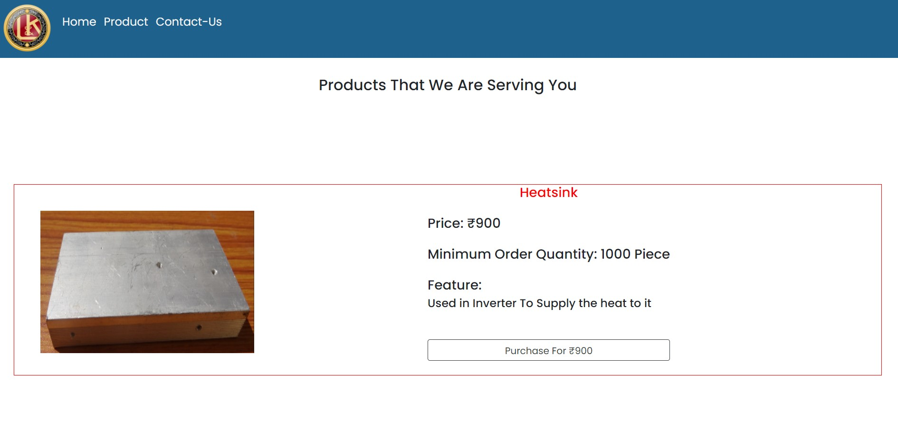
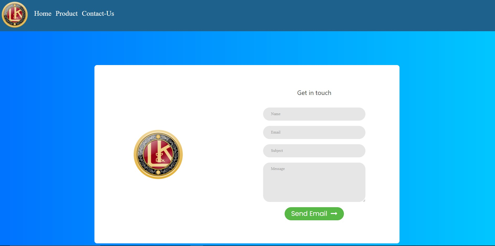
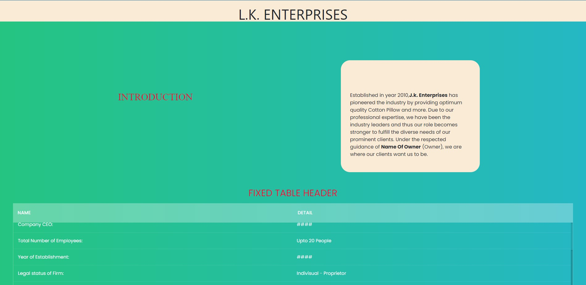
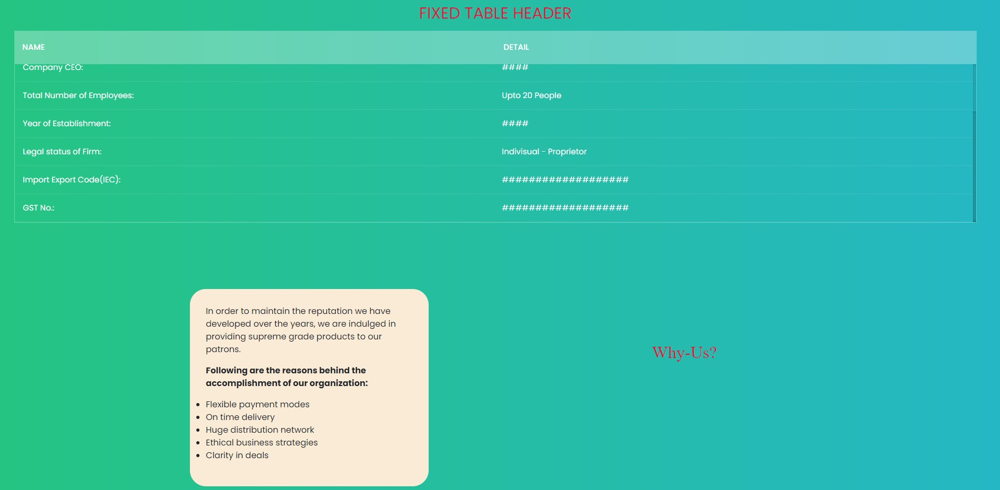

# [LK-Enterprises](https://lk-enterprises-delhi.herokuapp.com/) ⭐

&nbsp;
&nbsp;
&nbsp;
&nbsp;<br/>
&nbsp;
&nbsp;
&nbsp;


[](https://lk-enterprises-delhi.herokuapp.com/)
[](https://github.com/ROHAN842/lkenterprises)

## Overview 👀








- Ecommerce 🛒 website for company LK Enterprises 
- From Product page user can buy 🛍️ products of the company, which are mentioned in website
- Clean UI ⚡
- Company's Location 📍 can be easily seen 👀 by user beacause of Map 🗺️ section present in footer of every page of website
- User can easily contact ☎️ the authorities, regarding any query of the product from Contact 📝 Form of the website

## What is LK Enterprises? 🤔

#### This is an ecommerce website created by me and my 2 team mates for the company LK Enterprises of New Delhi. 
#### The front end is made with HTML5, CSS3, Bootstrap4 and Javascript, while the back end is made with Nodejs and Expressjs.
#### We used Nodemailer package of Nodejs for successfully sending customer query request through contact form.
#### For making successful payments we have used Stripe API on the product page while for tracking company location we have used Google Map's API in the footer section.


## How it works? 🤔
- **Open the website [https://lk-enterprises-delhi.herokuapp.com/](https://lk-enterprises-delhi.herokuapp.com/)**
- **User can easily view products displayed in form of Grid on the Home page of the website.**
- **If user wants to know more about company then he can just click on Read more button present on Home page of the website.**
- **User can easily buy 🛍️ products of the company, from product page of website, also payments can be easily done through Stripe API.**
- **If user has any query then user can easily contact ☎️ the authorities, from Contact 📝 Form of the website.**
- **If user wants to make a visit 🌇 at company, then he can easily make it by following company's location 📍 through Map 🗺️ present in footer section of every page of website.**


## Dependencies 🗃

- [Bootstrap](https://getbootstrap.com/) - **Frontend CSS3 Framework**
- [Node.js](https://nodejs.org/en/) - **Backend Framework**
- [Express.js](https://expressjs.com/) - **Server Side Node.js Framework**

## Run Locally 💻

```
> Clone the repo
    >> For Windows: Git Bash
    >> For Linux: Terminal
    >> git clone https://github.com/ROHAN842/lkenterprises.git
    >> cd lkenterprises
> Install all dependencies
    >> npm i
> Spin the server on port 3000
    >> cd lkenterprises
    >> nodemon or node app.js
> Visit the website on http://localhost:3000/
    
```
